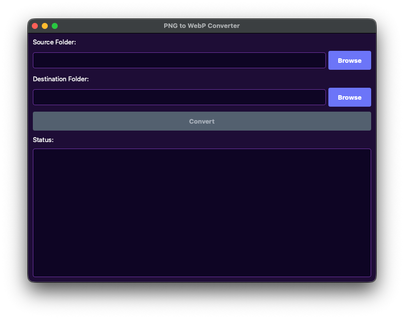

# PNG to WebP Batch Converter

GUI tool for batch converting PNG images to WebP format. Recursively processes directories while preserving folder structure in the export location.

## Requirements

- Python 3.10 or higher
- System dependencies for PyQt6 (varies by platform)

## Installation

1. Clone or download this repository

2. Create and activate a virtual environment:

```bash
python3 -m venv venv
source venv/bin/activate  # On Windows: venv\Scripts\activate
```

3. Install dependencies:

```bash
pip install -r requirements.txt
```

## Usage

1. Run the application:

```bash
python main.py
```

2. Select source folder:
   - Click "Browse" next to "Source Folder"
   - Navigate to the directory containing PNG files
   - The application will automatically discover all PNG files recursively

3. Select destination folder:
   - Click "Browse" next to "Destination Folder"
   - Choose where converted WebP files should be saved

4. Start conversion:
   - Click the "Convert" button
   - Progress is shown in the button text and status area
   - Each file conversion is logged with success or failure status

5. Review results:
   - The status area displays a summary of successful and failed conversions
   - Converted files are saved in the destination folder with the same directory structure as the source

## How It Works

- The application recursively searches the source directory for all PNG files (case-insensitive)
- Each PNG file is converted to WebP format with quality set to 85
- Directory structure is preserved: `/src/a/b/image.png` becomes `/dest/a/b/image.webp`
- Errors are handled per-file, so one failure does not stop the batch conversion
- Conversion runs in a background thread to keep the GUI responsive

## Screenshot



